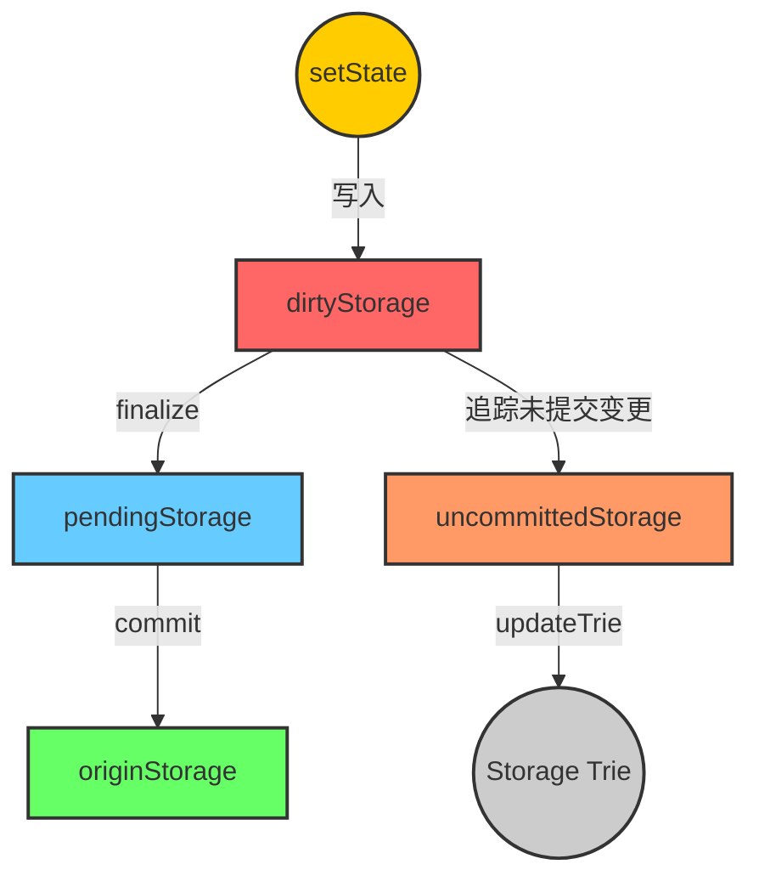

# 说明

> stateObject represents an Ethereum account which is being modified.

它是一个账户创建一个。

## state_account
s.data: types.StateAccount

这个结构体有一个字段：(types/state_account.go 中的内容)，就是$\sigma(a)$ 的相关的4个字段。
```go
// StateAccount is the Ethereum consensus representation of accounts.
// These objects are stored in the main account trie.
type StateAccount struct {
    Nonce    uint64
    Balance  *uint256.Int
    Root     common.Hash // merkle root of the storage trie
    CodeHash []byte
}
```

# 实现
### empty()

```go
func (s *stateObject) empty() bool {
    return s.data.Nonce == 0 && s.data.Balance.IsZero() && bytes.Equal(s.data.CodeHash, types.EmptyCodeHash.Bytes())

}
```

[[4.1 world state#空账户（Empty Account）]]


## new object
```go
// newObject creates a state object.
func newObject(db *StateDB, address common.Address, acct *types.StateAccount) *stateObject {
	origin := acct
	if acct == nil {
		acct = types.NewEmptyStateAccount()
	}
	return &stateObject{
		db:                 db,
		address:            address,
		addrHash:           crypto.Keccak256Hash(address[:]),
		origin:             origin,
		data:               *acct,
		originStorage:      make(Storage),
		dirtyStorage:       make(Storage),
		pendingStorage:     make(Storage),
		uncommittedStorage: make(Storage),
	}
}
```

传入的参数中，db 用于反射父类（比如通知错误、更新roothash 等），address 就是这个stateObject 所属的address。
acct 这里比较神奇。之所以有这样的操作，是因为geth 中并非全量把整个world state 都存入内存，很有可能是已经存在了一个stateObject，然后从数据库中读取它。见：[[StateDB.go#getStateObject]]
对于如下四个概念的不同，见 [[#四个storage]]
```go
		originStorage:      make(Storage),
		dirtyStorage:       make(Storage),
		pendingStorage:     make(Storage),
		uncommittedStorage: make(Storage),
```

## getState

主要逻辑见下面这个函数：

```go
// GetCommittedState retrieves the value associated with the specific key
// without any mutations caused in the current execution.
func (s *stateObject) GetCommittedState(key common.Hash) common.Hash {
	// If we have a pending write or clean cached, return that
	if value, pending := s.pendingStorage[key]; pending {
		return value
	}
	if value, cached := s.originStorage[key]; cached {
		return value
	}
	// If the object was destructed in *this* block (and potentially resurrected),
	// the storage has been cleared out, and we should *not* consult the previous
	// database about any storage values. The only possible alternatives are:
	//   1) resurrect happened, and new slot values were set -- those should
	//      have been handles via pendingStorage above.
	//   2) we don't have new values, and can deliver empty response back
	if _, destructed := s.db.stateObjectsDestruct[s.address]; destructed {
		s.originStorage[key] = common.Hash{} // track the empty slot as origin value
		return common.Hash{}
	}
	s.db.StorageLoaded++

	start := time.Now()
	value, err := s.db.reader.Storage(s.address, key)
	if err != nil {
		s.db.setError(err)
		return common.Hash{}
	}
	s.db.StorageReads += time.Since(start)

	// Schedule the resolved storage slots for prefetching if it's enabled.
	if s.db.prefetcher != nil && s.data.Root != types.EmptyRootHash {
		if err = s.db.prefetcher.prefetch(s.addrHash, s.origin.Root, s.address, nil, []common.Hash{key}, true); err != nil {
			log.Error("Failed to prefetch storage slot", "addr", s.address, "key", key, "err", err)
		}
	}
	s.originStorage[key] = value
	return value
}

```

## commit 


## updateRoot
```go
// updateRoot flushes all cached storage mutations to trie, recalculating the
// new storage trie root.
func (s *stateObject) updateRoot() {
	// Flush cached storage mutations into trie, short circuit if any error
	// is occurred or there is no change in the trie.
	tr, err := s.updateTrie()
	if err != nil || tr == nil {
		return
	}
	s.data.Root = tr.Hash()
}
```
### updateTrie
在 `obj.pendingStorage ` 中，遍历所有的storage key-value ，如果value 是空，就删除，如果非空，就更新，调用 
```go
tr.UpdateStorage(s.address, key[:], common.TrimLeftZeroes(value[:]))
```
详见：[[database.go#UpdateStorage,DeleteStorage]]

### 更新哈希

要更新本账户的 storage trie 的哈希。关键是怎么计算哈希。见 [[database.go#hash()]]


## finalize
清空 `s.dirtyStorage` ，更新uncommitedStorage 
#### 调用栈
- 对于每个dirtyStorage 中的key-value：
    - 如果在 uncommittedStorage 中存在 key-value：从中删除。
    - 如果在s.uncommittedStorage 中不存在 key-value：`s.uncommittedStorage[key] = s.GetCommittedState(key)` 见： [[#GetCommittedState]]
    - 在 s.pendingStorage 中添加key-value
 - 清空 s.dirtyStorage

## GetCommittedState
#### 调用栈
- 如果 `s.pendingStorage[key]` 存在，返回 `s.pendingStorage[key]`
- 否则，如果 `s.originStorage[key]` 存在，返回 `s.originStorage[key]`
- 否则，从` s.db.reader.Storage(s.address, key) `中 获得，更新 `s.originStorage[key]`，返回 `s.originStorage[key]`


# 四个storage
## 更新时机
### originStorage
1. <= 在[[#GetCommittedState]] 中，通过reader 读取历史上的账户状态。
2. <= 在 [[#commit]] 时，将 `pendingStorage` 中的内容转移至 `originStorage`，更新`originStorage`上储存的之前的状态。

### pendingStorage
1. <= [[#finalize]] 时，从 `dirtyStorage` 中转移至 `pendingStorage`
2. => 在 [[#commit]] 时，将 `pendingStorage` 中的内容转移至 `originStorage`，清空 `pendingStorage`

### dirtyStorage

1. <= `setState` 时，仅仅是往 `dirtyStorage` 中储存。这是一个fanout 特别多的函数，例如在`evm transition` 命令行中被调用。
2. => [[#finalize]] 时，从 `dirtyStorage` 中转移至 `pendingStorage`，清空 `dirtyStorage`

### uncommittedStorage

1. <= 在finalize 中
2. =>  在 [[#updateTrie]] 中，所有 储存在Storage trie 的 Storage 均来自于 `uncommittedStorage`。在 `updateTrie` 完成，即将退出时，清空 `uncommittedStorage`

## 总结



## 为什么

### uncommittedStorage(under 为什么)
#### 作用

> UncommittedStorage tracks a set of storage entries that have been modified but not yet committed since the "last commit operation", along with their original values before mutation.
> 
> Specifically, the commit will be performed after each transaction before the byzantium fork, therefore the map is already reset at the transaction boundary; however post the byzantium fork, the commit will only be performed at the end of block, this set essentially tracks all the modifications made within the block.


# 语法
## if语句中的短变量声明
```go
type Storage map[common.Hash]common.Hash
// pendingStorage：Storage 

// ...
if value, pending := s.pendingStorage[key]; pending {
	return value
}
```
**定义了一个 `Storage` 类型**，它是一个 `map`，键和值的类型都是 `common.Hash`

**Go 的 `map` 允许使用双返回值的方式来查询键**：

```go
val, exists := myMap[key]
```

这里是一个特殊语法，
在 Go 语言中，`if` 语句允许在条件判断前 **执行一个短变量声明**，其作用范围仅限于 `if` 语句的作用域内。例如：
```go
if x := someFunction(); x > 10 {
    fmt.Println("x is greater than 10")
}
```

同样，可以switch:
```go
switch num := getNumber(); num {
case 1:
    fmt.Println("One")
case 2:
    fmt.Println("Two")
default:
    fmt.Println("Other")
}
```

