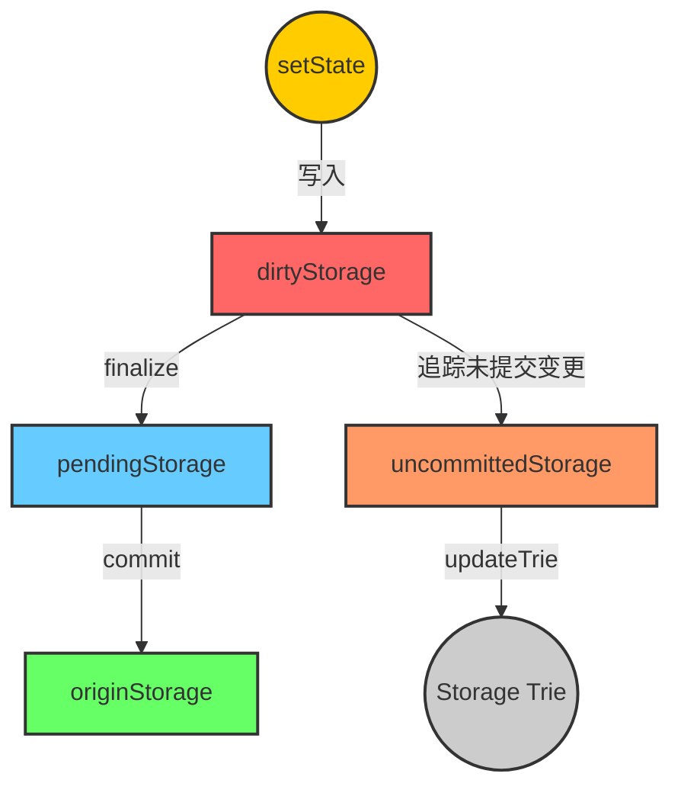

#archived 

# 说明

> stateObject represents an Ethereum account which is being modified.

它是一个账户创建一个。

## state_account
s.data: types.StateAccount

这个结构体有一个字段：(types/state_account.go 中的内容)，就是$\sigma(a)$ 的相关的4个字段。
```go
// StateAccount is the Ethereum consensus representation of accounts.
// These objects are stored in the main account trie.
type StateAccount struct {
    Nonce    uint64
    Balance  *uint256.Int
    Root     common.Hash // merkle root of the storage trie
    CodeHash []byte
}
```

# 实现
### empty()

```go
func (s *stateObject) empty() bool {
    return s.data.Nonce == 0 && s.data.Balance.IsZero() && bytes.Equal(s.data.CodeHash, types.EmptyCodeHash.Bytes())

}
```

[[4.1 world state#空账户（Empty Account）]]


## new object
```go
// newObject creates a state object.
func newObject(db *StateDB, address common.Address, acct *types.StateAccount) *stateObject {
	origin := acct
	if acct == nil {
		acct = types.NewEmptyStateAccount()
	}
	return &stateObject{
		db:                 db,
		address:            address,
		addrHash:           crypto.Keccak256Hash(address[:]),
		origin:             origin,
		data:               *acct,
		originStorage:      make(Storage),
		dirtyStorage:       make(Storage),
		pendingStorage:     make(Storage),
		uncommittedStorage: make(Storage),
	}
}
```

传入的参数中，db 用于反射父类（比如通知错误、更新roothash 等），address 就是这个stateObject 所属的address。
acct 这里比较神奇。之所以有这样的操作，是因为geth 中并非全量把整个world state 都存入内存，很有可能是已经存在了一个stateObject，然后从数据库中读取它。见：[[StateDB.go#getStateObject]]
对于如下四个概念的不同，见 [[#四个storage]]
```go
		originStorage:      make(Storage),
		dirtyStorage:       make(Storage),
		pendingStorage:     make(Storage),
		uncommittedStorage: make(Storage),
```

## GetState

如果在 dirtyStorage 中有key-value 的记录，那么返回dirtyStorage, 否则返回 [[#GetCommittedState]]。
总之是按照dirty->pending->origin 的顺序返回的，即：返回当前的状态。

## commit 
这个函数的作用是返回一个装了 stateObject 中全部内容的 `accountUpdate`。并且归档 pendingStorage.
### 调用栈
1. 赋值 accountUpdate，包括账户 address，RLP(s.data)(见：[[#state_account]])，contractCode(s.dirtycode)
2. 调用commitStorage，进一步更新 accountUpdate：
        对于 pendingStorage 的每个key,value:
            1. 计算 Keccak（key）
            2. 计算 RLPEncode(value)
            3. 写入 originStorage
        清空 pendingStorage
3. 调用 [[database.go#Commit]]


## updateRoot
```go
// updateRoot flushes all cached storage mutations to trie, recalculating the
// new storage trie root.
func (s *stateObject) updateRoot() {
	// Flush cached storage mutations into trie, short circuit if any error
	// is occurred or there is no change in the trie.
	tr, err := s.updateTrie()
	if err != nil || tr == nil {
		return
	}
	s.data.Root = tr.Hash()
}
```
### updateTrie
在 `obj.pendingStorage ` 中，遍历所有的storage key-value ，如果value 是空，就删除，如果非空，就更新，调用 
```go
tr.UpdateStorage(s.address, key[:], common.TrimLeftZeroes(value[:]))
```
详见：[[database.go#UpdateStorage,DeleteStorage]]

### 更新哈希

要更新本账户的 storage trie 的哈希。关键是怎么计算哈希。见 [[database.go#hash()]]


## finalize
清空 `s.dirtyStorage` ，更新uncommitedStorage 
#### 调用栈
- 对于每个dirtyStorage 中的key-value：
    - 如果在 uncommittedStorage 中存在 key，且value 等于原始值，说明这个值的修改被撤销了。`delete(s.uncommittedStorage, key)`
    - 如果在s.uncommittedStorage 中不存在 key：`s.uncommittedStorage[key] = s.GetCommittedState(key)` 见： [[#GetCommittedState]]
    - 在 s.pendingStorage 中添加key-value
 - 清空 s.dirtyStorage

#### 
## GetCommittedState
#### 调用栈
- 如果 `s.pendingStorage[key]` 存在，返回 `s.pendingStorage[key]`
- 否则，如果 `s.originStorage[key]` 存在，返回 `s.originStorage[key]`
- 特殊情况检查：如果这个合约被销毁了，返回空。
- 否则，从` s.db.reader.Storage(s.address, key) `中 获得，更新 `s.originStorage[key]` 作为缓存，返回 `s.originStorage[key]`
#### 作用
获得一个key 对应的在本次交易中的最终状态，用于更新 uncommittedStorage。简单的说，就是有pending 取pending，没有pending 就更新originStorage。


# 四个storage
## 更新时机
### originStorage
1. <= 在[[#GetCommittedState]] 中，通过reader 读取历史上的账户状态。
2. <= 在 [[#commit]] 时，将 `pendingStorage` 中的内容转移至 `originStorage`，更新`originStorage`上储存的之前的状态。

### pendingStorage
1. <= [[#finalize]] 时，从 `dirtyStorage` 中转移至 `pendingStorage`
2. => 在 [[#commit]] 时，将 `pendingStorage` 中的内容转移至 `originStorage`，清空 `pendingStorage`

### dirtyStorage

1. <= `setState` 时，仅仅是往 `dirtyStorage` 中储存。这是一个fanout 特别多的函数，例如在`evm transition` 命令行中被调用。
2. => [[#finalize]] 时，从 `dirtyStorage` 中转移至 `pendingStorage`，清空 `dirtyStorage`

### uncommittedStorage

1. <= 在 finalize 中
2. =>  在 [[#updateTrie]] 中，所有 储存在Storage trie 的 Storage 均来自于 `uncommittedStorage`。在 `updateTrie` 完成，即将退出时，清空 `uncommittedStorage`

## 总结



## 为什么

### 为什么需要 uncommittedStorage

> UncommittedStorage tracks a set of storage entries that have been modified but not yet committed since the "last commit operation", along with their original values before mutation.
> 
> Specifically, the commit will be performed after each transaction before the byzantium fork, therefore the map is already reset at the transaction boundary; however post the byzantium fork, the commit will only be performed at the end of block, this set essentially tracks all the modifications made within the block.

#### Byzantium 分叉前：

- 每笔交易之后都立即 `commit`，状态与数据库保持同步。
- 所以每笔交易的状态改动都可以直接提交，无需追踪整个区块的变动。

#### Byzantium 分叉后：

- 改为 **整块（block-level）commit**：一整块执行完之后才进行一次 commit。
- 在此期间，多个交易可能对同一个 storage 槽进行多次修改。
- 为了能正确地计算出最终的 storage trie（状态树），我们必须知道：
    - 每个变更槽位在**本区块执行前**的原始值。
    - 哪些槽位在本区块中被修改过。

槽位上变更storage 的 计算的方法见：[[#GetCommittedState]] 。


# 语法
## if语句中的短变量声明
```go
type Storage map[common.Hash]common.Hash
// pendingStorage：Storage 

// ...
if value, pending := s.pendingStorage[key]; pending {
	return value
}
```
**定义了一个 `Storage` 类型**，它是一个 `map`，键和值的类型都是 `common.Hash`

**Go 的 `map` 允许使用双返回值的方式来查询键**：

```go
val, exists := myMap[key]
```

这里是一个特殊语法，
在 Go 语言中，`if` 语句允许在条件判断前 **执行一个短变量声明**，其作用范围仅限于 `if` 语句的作用域内。例如：
```go
if x := someFunction(); x > 10 {
    fmt.Println("x is greater than 10")
}
```

同样，可以switch:
```go
switch num := getNumber(); num {
case 1:
    fmt.Println("One")
case 2:
    fmt.Println("Two")
default:
    fmt.Println("Other")
}
```

