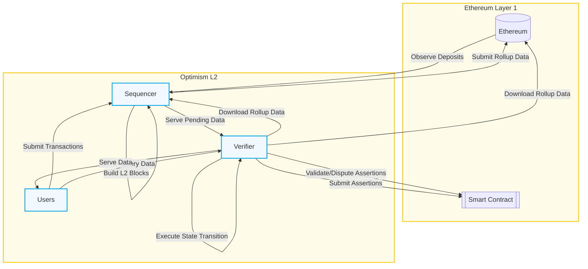

# 概括
user 是提交Transaction，以及读交易数据的人。
sequencer 是处理交易的主体，它把交易”打包“到L2 block，交易的来源是用户、以及直接上L1 的deposit 。也负责把L2 提交到L1.
verifier 从L1 上拿数据做验证。或者作为 proposer challenger。指的是除了user 以外的另一个主体，比如user 发送了一个转账，verifier 拿到转账，拿了数据，自己重新跑一遍，把结果和L2 对比，就是验证过程。

## 例子
### deposit 
![[Pasted image 20250422212828.png]]

上述直接覆盖了sequencer 的全部功能：接受用户的交易，从L1 上读deposit，以及打包交易到L1（出现了一个叫 batch inbox address 的概念）
deposit 指的是直接包括在 L1 而不是提交给sequencer 的区块。

### withdraw

![[Pasted image 20250422213104.png]]
withdraw 指的是从L2 到 L1 的message call。L2 向 L1 写内容。

这个例子复杂非常多。其中，
FaultDisputeGame 是一个L1 上的智能合约，来验证L2 状态是否有效。
一个proposer 提交某个状态，其他人如果认为状态是错误的，可以发起一个 [dispute game](https://specs.optimism.io/fault-proof/stage-one/fault-dispute-game.html)。
上面的图中，proposer 声明了一个L2状态，因此创建了一个 dispute game，其他人验证后，达成 finalize 状态，withdraw 在L1 上生效。

下面将逐步更新理解
![[Pasted image 20250423080004.png]]
确实 sequencer 和 verifier 的组成很类似，都有一个 Execution Engine，它是geth 的包装，用来执行交易。
rollup node 的作用是产生 L2 chain，数据的来源是L1 block。它大概是 InsertBlock 和打包Block 等API的调用者，同步状态的作用。

注：上述的由Rollup Node 执行的过程叫做 [derive](https://specs.optimism.io/protocol/overview.html#block-derivation)

