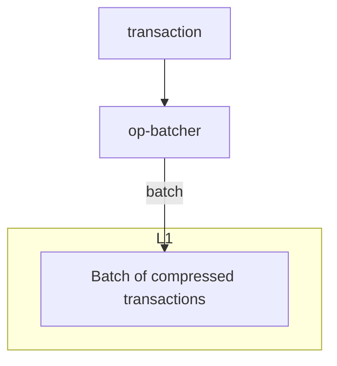

# OP stack
## deposit
https://docs.optimism.io/stack/transactions/deposit-flow

>"_deposit transaction_" refers to any L2 transaction that is triggered by a transaction or event on L1.

## batcher
https://docs.optimism.io/stack/transactions/transaction-flow
它的功能定位最接近我最原始的理解Rollup 的概念，提交在L2 上的transaction：


## proposer/challenger
>In optimistic settlement mechanisms generally, **Proposer** entities can propose what they believe to be the current valid state of the OP Stack chain.

**Proposer** 把 ouput roots 通过L2 到 L1 的消息发给特定的Dispute game 合约。它为withdraw 提供依据。
质疑Proposer 的角色叫做 **Challenger**。
两者通过dispute game 交互。它们分别提供root，并决定一个最终状态的正确性。

## verifier/sequencer

关于什么是sequenncer 和 verifier：[官方规范](## [Network Participants](https://specs.optimism.io/background.html?highlight=verifier#network-participants))
可以发现这是在网络参与者层面的。两者都依赖执行器（也就是Rollup node）。区别在于，sequencer 执行交易的数量更多，但是执行的交易不安全。verifier 也自己执行交易，但是他们的交易被认证。
sequencer 完全运行在L2上，用来在L2 中维持链。verifier 的运行方式是直接通过内存储存整个state， 然后快速的无状态的执行交易，目的是verify 而非出块。
一般来说，verifier 同时也是proposer/challenger，因为状态哈希的用途就是做dispute game。

sequencer 和 batcher 的作用见：
![[Pasted image 20250430212845.png]]

## derivation 

定义为一个状态无关、只读的纯函数：
```
derive_rollup_chain(l1_blockchain) -> rollup_blockchain
```
依赖sequencing 的输出，依靠EVM 执行得到结果。