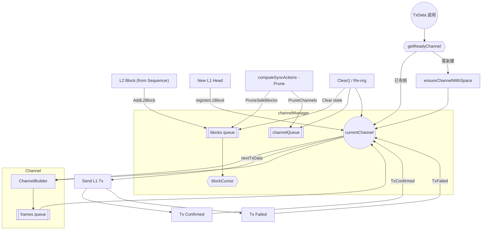

- PruneSafeBlocks
- AddL2Block
- TxData 发送数据来源，
- TxConfirmed 标记交易完成

# 流程
还综合了 channel 和 channel Builder：

关键路径：

1. Sequencer 产块 → `AddL2Block` 存入 BlocksQ。
2. 调度器调用 `TxData()`：  
    • 若 `channelQueue` 里已有帧，直接取；  
    • 否则创建/补充 `currentChannel`，把 BlocksQ 的区块 `AddBlock` → `outputFrames`。
3. 有帧就生成交易数据 (`nextTxData`) 并发往 L1。
4. 收到成功/失败回执后调用 `TxConfirmed` / `TxFailed`，可能触发重试或整条 Channel 作废。
5. 每来一个新的 L1 头，用 `registerL1Block` 做超时检测；若超时 Channel 被标为 **full**。
6. `computeSyncActions` 定期根据 Safe / Unsafe head 剪掉已安全的数据（Prune）。
7. 若链重组或人工清理，`Clear()` 一键重置全部内存状态。

其中，prune 的逻辑见 [[sync_actions.go]]

