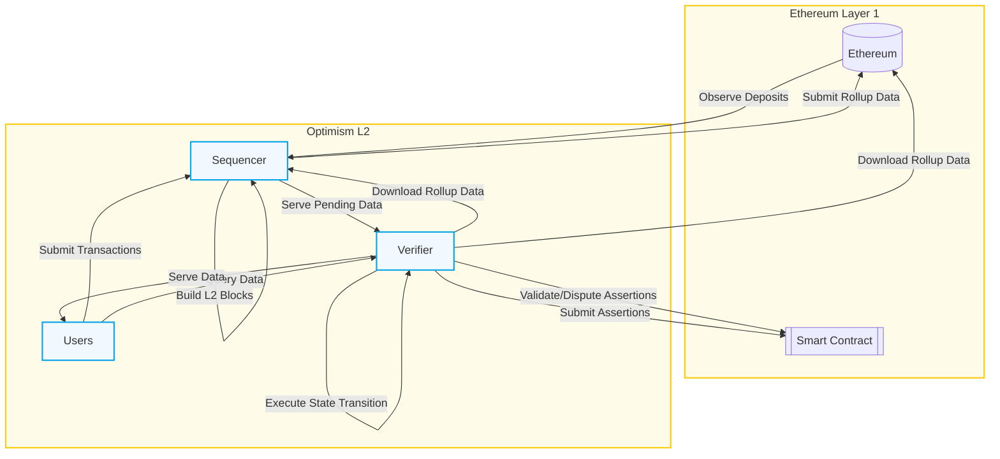

# 概括
user 是提交Transaction，以及读交易数据的人。
sequencer 是处理交易的主体，它把交易”打包“到L2 block，交易的来源是用户、以及直接上L1 的deposit 交易。也负责把L2 提交到L1.
verifier 从L1 上拿数据做验证。或者作为 proposer challenger。

并没有看得很懂。特别是verifier。

## 例子
### 存款使用
![[Pasted image 20250422212828.png]]

上述直接覆盖了sequencer 的全部功能：接受用户的交易，从L1 上读deposit，以及打包交易到L1（出现了一个叫 batch inbox address 的概念）

### withdraw

![[Pasted image 20250422213104.png]]
这个例子复杂非常多。其中，
FaultDisputeGame 是一个L1 上的智能合约，来验证L2 状态是否有效。
一个proposer 提交某个状态，其他人如果认为状态是错误的，可以发起一个 [dispute game](https://specs.optimism.io/fault-proof/stage-one/fault-dispute-game.html)。
上面的图中，proposer 声明了一个L2状态，因此创建了一个 dispute game，其他人验证后达成 finalize 状态，从而让这个交易可以最终影响合约。

下面将逐步更新理解
# sequencer

# verifier
